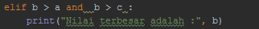

# Macam - Macam Kondisional di Python
 #
## Menentukan Bilangan Terbesar ##

- Ada tiga macam kondisional di Python, yang dapat Anda gunakan untuk membangun alur logika untuk program Anda. 
Python memiliki statement __if__, __if..else__, dan __if..elif..else__. 
Berikut ini adalah contoh penggunaan if di Python:

	

- Bila kondisi yang akan didefinisikan cukup banyak, Anda dapat menambah kondisi lain dengan menggunakan elif di bawah statement "if" dan sebelum statement "else":

	

- Untuk memeriksa kondisi yang tidak memenuhi kondisi utama. 
Maka else digunakan untk menangani semua kondisi selain kondisi yang telah dituliskan. 
Berikut adalah contoh penggunaan else di dalam kondisional Python:

	

## Hasil Eksekusi ##

